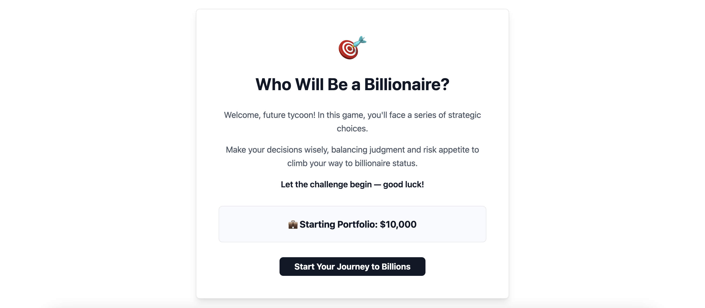

# Who Will Be a Billionaire?

## Game Description


"Who Will Be a Billionaire?" is an interactive investment simulation game. You start with a virtual portfolio of $10,000 and choose one of five assets to invest in:

- TechNova
- HealthZen
- GreenCore
- FinTrust
- CryptoX

For each asset, you will face a series of real-world inspired events and must make strategic decisions at each step. Your choices will multiply or reduce your portfolio value based on your risk appetite and judgment. The goal is to grow your portfolio to $1,000,000,000 (one billion dollars) through wise investment decisions. If you reach billionaire status, you win!


## Play Online

Click [this link](https://tycoon-tales-ui.lovable.app/) to play the game interactively in your browser!

## Downloading the Game

You can download the latest version of "Who Will Be a Billionaire?" from GitHub:

```
git clone https://github.com/rajashreeagrawal97/Who-will-be-a-Billionaire.git
```

Then navigate into the project directory:

```
cd Who-will-be-a-Billionaire
```

## How to Run the Game

1. **Requirements:**
   - Python 3.x installed on your system (macOS comes with Python, but you can check by running `python3 --version` in your terminal).

2. **Running the Game:**
   - Open your terminal (zsh or any shell).
   - Navigate to the project directory:
     ```zsh
     cd Who-will-be-a-Billionaire
     ```
   - Run the game with:
     ```zsh
     python3 who_will_be_a_billionaire.py
     ```

3. **Gameplay:**
   - Follow the on-screen prompts to select your asset and make decisions for each event.
   - Enter the number corresponding to your choice when prompted.
   - Your portfolio value will be updated after each decision.
   - Try to reach $1,000,000,000 to win!

Enjoy the game and see if you have what it takes to become a billionaire investor!
